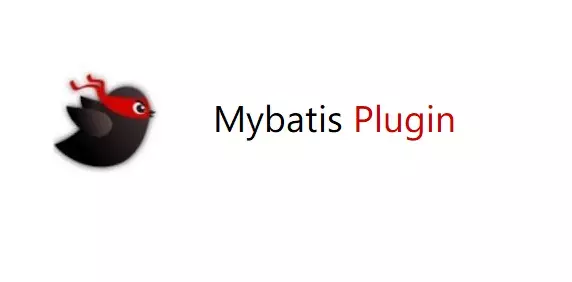
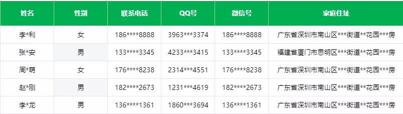

## 前言
在日常开发中，身份证号、手机号、卡号、客户号等个人信息都需要进行数据脱敏。否则容易造成个人隐私泄露，客户资料泄露，给不法分子可乘之机。但是数据脱敏不是把敏感信息隐藏起来，而是看起来像真的一样，实际上不能是真的。我以前的公司就因为不重视脱敏，一名员工在离职的时候通过后台的导出功能导出了核心的客户资料卖给了竞品，给公司造成了重大的损失。当然这里有数据管理的原因，但是脱敏仍旧是不可忽略的一环，脱敏可以从一定程度上保证数据的合规使用。下面就是一份经过脱敏的数据：

##  Mybatis 脱敏插件

最近在研究**Mybatis**的插件，所以考虑能不能在ORM中搞一搞脱敏，所以就尝试了一下，这里分享一下思路。借此也分享一下**Mybatis**插件开发的思路。

### Mybatis 插件接口
**Mybatis**中使用插件，需要实现接口`org.apache.ibatis.plugin.Interceptor`，如下所示：

``` java
public interface Interceptor {

  Object intercept(Invocation invocation) throws Throwable;

  default Object plugin(Object target) {
    return Plugin.wrap(target, this);
  }

  default void setProperties(Properties properties) {
    // NOP
  }

}
```
这里其实最核心的是`Object intercept(Invocation invocation)`方法，这是我们需要实现的方法。

### Invocation 对象
那么核心方法中的`Invocation`是个什么概念呢？
``` java
public class Invocation {

  private final Object target;
  private final Method method;
  private final Object[] args;

  public Invocation(Object target, Method method, Object[] args) {
    this.target = target;
    this.method = method;
    this.args = args;
  }

  public Object getTarget() {
    return target;
  }

  public Method getMethod() {
    return method;
  }

  public Object[] getArgs() {
    return args;
  }

  public Object proceed() throws InvocationTargetException, IllegalAccessException {
    return method.invoke(target, args);
  }

}
```
这个东西包含了四个概念：

- **target** 拦截的对象
- **method** 拦截target中的具体方法，也就是说**Mybatis**插件的粒度是精确到方法级别的。
- **args** 拦截到的参数。
- **proceed** 执行被拦截到的方法，你可以在执行的前后做一些事情。

### 拦截签名
既然我们知道了**Mybatis**插件的粒度是精确到方法级别的，那么疑问来了，插件如何知道轮到它工作了呢？

所以**Mybatis**设计了签名机制来解决这个问题，通过在插件接口上使用注解`@Intercepts`标注来解决这个问题。
```java
@Intercepts(@Signature(type = ResultSetHandler.class,
        method = "handleResultSets",
        args = {Statement.class}))
```
就像上面一样，事实上就等于配置了一个`Invocation`。

### 插件的作用域
那么问题又来了，**Mybatis**插件能拦截哪些对象,或者说插件能在哪个生命周期阶段起作用呢？它可以拦截以下四大对象：

- **Executor** 是**SQL**执行器，包含了组装参数，组装结果集到返回值以及执行**SQL**的过程，粒度比较粗。
- **StatementHandler** 用来处理**SQL**的执行过程，我们可以在这里重写**SQL**非常常用。
- **ParameterHandler** 用来处理传入**SQL**的参数，我们可以重写参数的处理规则。
- **ResultSetHandler** 用于处理结果集，我们可以重写结果集的组装规则。

你需要做的就是明确的你的业务需要在上面四个对象的哪个处理阶段拦截处理即可。

### MetaObject
**Mybatis**提供了一个工具类`org.apache.ibatis.reflection.MetaObject`。它通过反射来读取和修改一些重要对象的属性。我们可以利用它来处理四大对象的一些属性，这是**Mybatis**插件开发的一个常用工具类。

- **Object getValue(String name)** 根据名称获取对象的属性值，支持**OGNL**表达式。
- **void setValue(String name, Object value)** 设置某个属性的值。
- **Class<?> getSetterType(String name)** 获取**setter**方法的入参类型。
- **Class<?> getGetterType(String name)** 获取**getter**方法的返回值类型。

通常我们使用`SystemMetaObject.forObject(Object object)`来实例化`MetaObject`对象。你会在接下来的实战DEMO中看到我使用它。

## Mybatis 脱敏插件实战
接下来我就把开头的脱敏需求实现一下。首先需要对脱敏字段进行标记并确定使用的脱敏策略。

编写脱敏函数：
```java
/**
 * 具体策略的函数
 * @author felord.cn
 * @since 11:24
 **/
public interface Desensitizer  extends Function<String,String>  {

}
```
编写脱敏策略枚举：
```java
/**
 * 脱敏策略.
 *
 * @author felord.cn
 * @since 11 :25
 */
public enum SensitiveStrategy {
    /**
     * Username sensitive strategy.
     */
    USERNAME(s -> s.replaceAll("(\\S)\\S(\\S*)", "$1*$2")),
    /**
     * Id card sensitive type.
     */
    ID_CARD(s -> s.replaceAll("(\\d{4})\\d{10}(\\w{4})", "$1****$2")),
    /**
     * Phone sensitive type.
     */
    PHONE(s -> s.replaceAll("(\\d{3})\\d{4}(\\d{4})", "$1****$2")),

    /**
     * Address sensitive type.
     */
    ADDRESS(s -> s.replaceAll("(\\S{8})\\S{4}(\\S*)\\S{4}", "$1****$2****"));


    private final Desensitizer desensitizer;

    SensitiveStrategy(Desensitizer desensitizer) {
        this.desensitizer = desensitizer;
    }

    /**
     * Gets desensitizer.
     *
     * @return the desensitizer
     */
    public Desensitizer getDesensitizer() {
        return desensitizer;
    }
}
```
编写脱敏字段的标记注解：
```java
@Retention(RetentionPolicy.RUNTIME)
@Target(ElementType.FIELD)
public @interface Sensitive {
    SensitiveStrategy strategy();
}
```
我们的返回对象中如果某个字段需要脱敏，只需要通过标记就可以了。例如下面这样：
```java
@Data
public class UserInfo {

    private static final long serialVersionUID = -8938650956516110149L;
    private Long userId;
    @Sensitive(strategy = SensitiveStrategy.USERNAME)
    private String name;
    private Integer age;
}
```
然后就是编写插件了，我可以确定的是需要拦截的是`ResultSetHandler`对象的`handleResultSets`方法，我们只需要实现插件接口`Interceptor`并添加签名就可以了。全部逻辑如下：
```java
@Slf4j
@Intercepts(@Signature(type = ResultSetHandler.class,
        method = "handleResultSets",
        args = {Statement.class}))
public class SensitivePlugin implements Interceptor {
    @SuppressWarnings("unchecked")
    @Override
    public Object intercept(Invocation invocation) throws Throwable {
        List<Object> records = (List<Object>) invocation.proceed();
        // 对结果集脱敏
        records.forEach(this::sensitive);
        return records;
    }


    private void sensitive(Object source) {
        // 拿到返回值类型
        Class<?> sourceClass = source.getClass();
        // 初始化返回值类型的 MetaObject
        MetaObject metaObject = SystemMetaObject.forObject(source);
        // 捕捉到属性上的标记注解 @Sensitive 并进行对应的脱敏处理
        Stream.of(sourceClass.getDeclaredFields())
                .filter(field -> field.isAnnotationPresent(Sensitive.class))
                .forEach(field -> doSensitive(metaObject, field));
    }


    private void doSensitive(MetaObject metaObject, Field field) {
        // 拿到属性名
        String name = field.getName();
        // 获取属性值
        Object value = metaObject.getValue(name);
        // 只有字符串类型才能脱敏  而且不能为null
        if (String.class == metaObject.getGetterType(name) && value != null) {
            Sensitive annotation = field.getAnnotation(Sensitive.class);
            // 获取对应的脱敏策略 并进行脱敏
            SensitiveStrategy type = annotation.strategy();
            Object o = type.getDesensitizer().apply((String) value);
            // 把脱敏后的值塞回去
            metaObject.setValue(name, o);
        }
    }
}
```
然后配置脱敏插件使之生效：
```java
@Bean
public SensitivePlugin sensitivePlugin(){
    return new SensitivePlugin();
}
```
操作查询获得结果 UserInfo(userId=123123, name=李*龙, age=28) ，成功将指定字段进行了脱敏。

补充一句，其实脱敏也可以在**JSON**序列化的时候进行。

## 总结
今天对编写**Mybatis**插件的一些要点进行了说明，同时根据说明实现了一个脱敏插件。但是请注意一定要熟悉四大对象的生命周期，否则自写插件可能会造成意想不到的结果。插件可以关注：**码农小胖哥** 回复关键字 **sensitive** 进行获取。如果你觉得有用请无情的点赞。

关注公众号：Felordcn获取更多资讯

个人博客：https://felord.cn


----------


**[阅读原文](https://my.oschina.net/10000000000/blog/4483667)**